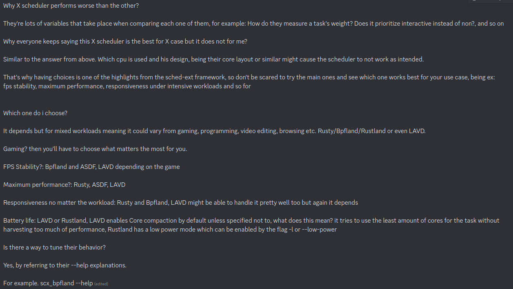

# Low-latency Linux gaming

THIS GUIDE IS UNFINISHED, AND MAY NEVER BE FINISHED

This is not a step-by-step guide but rather a collection of resources and things to consider when tuning Linux systems for low-latency, low-jitter gaming. 

This is targeted toward more experienced users, due to the fact that many settings listed here cannot be blindly applied, and require some understanding of what is going on. That said, I don't claim to be an authority on this subject either, and some information here may be incorrect or misleading.

Before reading this guide, please go through [PC-Tuning](https://github.com/valleyofdoom/PC-Tuning) to learn how to properly configure your hardware and UEFI/BIOS settings (you can ignore the Windows-specific steps).

# Sections

* [1. Distributions](#1-distributions)
    * [CachyOS](#cachyos)
    * [Gentoo](#gentoo)
* [2. Kernel Parameters](#2-kernel-parameters)
    * [General](#general)
    * [Intel CPUs](#intel-cpus)
    * [AMD CPUs](#amd-cpus)
* [3. Schedulers](#3-schedulers)
* [4. Display servers, compositors, & window managers](#4-display-servers-compositors--window-managers)
    * [Xorg](#xorg)
    * [Wayland](#wayland)
* [5. libinput](#5-libinput)
    * [Mouse sensitivity](#mouse-sensitivity)
    * [Debouncing](#debouncing)
* [6. NVIDIA GPUs](#6-nvidia-gpus)
    * [nvidia-settings](#nvidia-settings)
* [7. AMD GPUs](#7-amd-gpus)
* [8. Intel GPUs](#8-intel-gpus)
* [9. Audio](#9-audio)
* [10. File systems & storage](#10-file-systems--storage)
* [11. Wine](#11-wine)
* [12. Recording](#12-recording)
* [13. Further Reading](#13-further-reading)

# 1. Distributions

## CachyOS

[Website](https://cachyos.org/)

Arch-based distribution that comes with its own optimized repositories and offers custom kernels with various patches (& optimizations such as LTO). Highly recommended.

I'm not going to go too deep into kernel-related tuning (besides kernel parameters) in this guide because the CachyOS kernels are essentially as good as it gets.

[Information about the CachyOS kernels](https://wiki.cachyos.org/kernel/kernel/)

[Information about the CachyOS repositories](https://wiki.cachyos.org/cachyos_repositories/what_are_the_cachyos_repo/)

## Gentoo

[Website](https://www.gentoo.org/)

Source-based distribution which may offer minor performance gains over CachyOS (in exchange for time spent configuring & compiling). Gentoo also now provides pre-built binaries for common packages (including some built specifically for the x86-64-v3 ISA, similar to CachyOS), but it's still more work than CachyOS for relatively little benefit.

# 2. Kernel parameters

Don't use kernel parameters if you don't know what effects they have! This applies doubly so for random kernel parameters you find online with no explanation of what they do.

Some of the parameters listed may compromise the security or stability of your machine.

## General

If you want to disable power saving related settings, I would advise disabling them in both UEFI/BIOS settings as well as kernel parameters. I say this due to stuttering that I experienced in the past, which was caused by having processor C-States disabled in UEFI but not in kernel parameters. I assume that something tried to "override" my UEFI settings.

And similarly to the issue I personally experienced, the impression I get is that you should be redudant with your settings, just to be on the safe side. Even [Intel](https://www.intel.com/content/www/us/en/developer/articles/technical/optimizing-computer-applications-for-latency-part-1-configuring-the-hardware.html) recommends using all 3 of the following parameters: `intel_idle.max_cstate=0`, `processor.max_cstate=0`, and `idle=poll`, despite the fact that `idle=poll` should make the other two redundant. This may just be paranoia though.

| Parameter | Explanation |
| ---       | ---         |
| `mitigations=off` | Disable CPU security mitigations, which often come with a performance penalty. Obviously, this will make your system less secure. |
| `nowatchdog` | Disable watchdog timers to [reduce interrupts](https://wiki.archlinux.org/title/Power_management#Disabling_NMI_watchdog). |
| `nosoftlockup` | Don't log backtraces for processes that execute for longer than 120 seconds without yielding. Probably doesn't matter for any games. |
| `audit=0` | Disable the [audit framework](https://wiki.archlinux.org/title/Audit_framework) to marginally reduce overhead (mentioned in section 8 of RHEL's [latency tuning guide](https://access.redhat.com/sites/default/files/attachments/201501-perf-brief-low-latency-tuning-rhel7-v2.1.pdf)). |
| `usbcore.autosuspend=60` | Set USB autosuspend timer to 60 seconds. Alternatively, replace `60` with any other value. A negative value will disable autosuspend entirely. |
| `workqueue.power_efficient=false` | Disable [power-efficient workqueues](https://lwn.net/Articles/731052/) if enabled in your kernel configuration, which may cause cache misses due to workqueues being scheduled onto different cores. |
| `skew_tick=1` | Skew timer ticks on different cores to [reduce lock contention](https://docs.redhat.com/en/documentation/red_hat_enterprise_linux_for_real_time/7/html/tuning_guide/reduce_cpu_performance_spikes). |
| `threadirqs` | [Thread interrupt handlers](https://wiki.linuxfoundation.org/realtime/documentation/technical_details/threadirq) by default. |
| `tsc=reliable` | Disable clocksource verification for TSC, which may slightly reduce overhead. Not recommended due to the potential for [clock desync](https://lwn.net/Articles/388188/). |
| `preempt=full` | Allow preemption of [almost all](https://wiki.linuxfoundation.org/realtime/documentation/technical_basics/preemption_models) kernel code. |
| `nohz_full=all` | Use tickless mode on all cores wherever possible (specifically, when there is at most one runnable task on a core). Alternatively, you can replace `all` with a range or comma-separated list of cores to make tickless, e.g. `2-5,7,8`. This is [not necessarily beneficial](https://www.kernel.org/doc/Documentation/timers/NO_HZ.txt). In addition, [`isolcpus`](https://access.redhat.com/solutions/480473) can be used to force a specific task to always run tickless. |
| `cpufreq.default_governor=performance` | Set the default [frequency scaling governor](https://wiki.archlinux.org/title/CPU_frequency_scaling#Scaling_governors) to `performance`. |
| `pcie_aspm=off` | Force [ASPM](https://en.wikipedia.org/wiki/Active_State_Power_Management) off for all PCIE devices. Make sure to disable ASPM in UEFI/BIOS settings as well. |
| `processor.max_cstate=0` | Don't allow processor to sleep deeper than the C1 state. This will prevent your CPU from reaching its maximum single-core boost clock (if running stock frequencies), but reduces jitter substantially. This will increase idle power usage. Make sure to disable C-States in UEFI/BIOS settings as well. |
| `idle=poll` | Force CPU into the C0 state (significantly increasing idle power usage). Don't use if you have hyperthreading/SMT enabled. Also, [Linux kernel documentation](https://www.kernel.org/doc/Documentation/x86/x86_64/boot-options.txt) says that this parameter provides no performance advantage on CPUs with MWAIT support, which is all modern x86 CPUs. However, the aforementioned Intel latency tuning guide (which was updated in 2017) still recommends this parameter, so I'm not sure what to make of this one. RHEL's latency tuning guide also recommends using this parameter. |

## Intel CPUs

Use [`i7z`](https://code.google.com/archive/p/i7z/) to verify that your processor is running at the correct frequency & C-States.

| Parameter | Explanation |
| ---       | ---         |
| `intel_pstate=disable` | [Disable](https://www.kernel.org/doc/Documentation/cpu-freq/intel-pstate.txt) the `intel_pstate` driver. |
| `intel_idle.max_cstate=0` | [Disable](https://docs.kernel.org/admin-guide/pm/cpuidle.html) the `intel_idle` driver and fall back on `acpi_idle`. |
| `modprobe.blacklist=iTCO_wdt` | `nowatchdog` may [fail](https://wiki.archlinux.org/title/Improving_performance#Watchdogs) to disable the Intel TCO watchdog, this is a fix (not necessary on CachyOS). |

## AMD CPUs

TODO

# 3. Schedulers

* [BORE](https://github.com/firelzrd/bore-scheduler)

* [sched-ext](https://wiki.cachyos.org/kernel/sched-ext/)



(from Aarrayy in the CachyOS Discord)

If unsure, `BORE` or `rusty` are both solid picks (BORE is used by default in CachyOS). But the best choice will depend on your choice of game, your hardware, and whether you have anything else running while playing (e.g. recording software).

# 4. Display servers, compositors, & window managers

TODO: WM/compositor comparison

## Xorg

The most popular implementation of the X11 display protocol. The more mature and better-supported option compared to Wayland, often the safer choice unless you're trying to do multi-monitor VRR. Xorg may also make it easier to configure GPU and input related settings, depending on your setup and needs.

Ensure you disable desktop composition while gaming if using Xorg. The way to do this will depend on your choice of compositor/DE. I personally don't use desktop composition anywhere, because the latency bothers me more than the tearing even on the desktop, but it's up to you.

## Wayland

Not a display server in itself, but a protocol implemented by various display servers (called "Wayland compositors"). Offers the potential for tear-free gaming with [relatively low latency](https://artemis.sh/2022/09/18/wayland-from-an-x-apologist.html), without the need for VRR.

# 5. libinput

## Mouse sensitivity

libinput makes it difficult to set mouse sensitivity to an exact ratio (e.g. exactly 50% sensitivity). There is a way to achieve this, however, although it only works on Xorg (I'm not sure of any way to do it on Wayland). Basically, what you have to do is create a file in `/etc/X11/xorg.conf.d/` called something like `50-mouse-sensitivity.conf`, with the following content:

```
Section "InputClass"
	Identifier "All Mice"
	MatchIsPointer "on"
	Driver "libinput"
	Option "AccelProfile" "flat"
	Option "TransformationMatrix" "1 0 0 0 1 0 0 0 1"
EndSection
```

Setting `AccelProfile` to `flat` disables mouse acceleration.

`TransformationMatrix` is a matrix of values that can be used to warp mouse input in [various ways](https://wiki.ubuntu.com/X/InputCoordinateTransformation). But all you need to know for this section is that your mouse sensitivity is effectively divided by the last digit of this matrix. For instance, setting the last digit to `4`, i.e. `Option "TransformationMatrix" "1 0 0 0 1 0 0 0 4"`, will divide your effective sensitivity by 4 (resulting in 25% sensitivity). Setting the last digit to `0.25` will divide your effective sensitivity by 0.25 (resulting in 400% sensitivity).

Instead of `MatchIsPointer`, you can do something like `MatchVendor "Razer"` or `MatchProduct "Viper 8K"` if you don't want the configuration to apply to all mice: in this example, it will search for the substring `"Viper 8K"` within the product's name, so you don't need to know the full, exact name of the mouse that your system sees.

## Debouncing

libinput adds [eager debouncing](https://wayland.freedesktop.org/libinput/doc/latest/button-debouncing.html) to all mice by default. This does not add latency to clicks or releases in most cases, but it prevents you from making very short or very fast clicks, and is completely unnecessary on mice that use optical switches or latch debouncing, as well as mice that already offer configurable debounce time in their software.

To disable it, create the file `/etc/libinput/local-overrides.quirks` (if it does not exist already), and add the following lines to it:

```
[Mouse Debouncing]
MatchUdevType=mouse
ModelBouncingKeys=1
```

# 6. NVIDIA GPUs

This section is written with Xorg & the proprietary NVIDIA drivers in mind.

* [OpenGL environment variables](https://download.nvidia.com/XFree86/Linux-x86_64/555.58.02/README/openglenvvariables.html): Of particular interest is the section on `__GL_YIELD`. It's also worth looking into `__GL_MaxFramesAllowed`, but I can't find any official documentation for it.

* [Kernel Module Parameters](https://wiki.gentoo.org/wiki/NVIDIA/nvidia-drivers#Kernel_module_parameters): Notable are `NVreg_InitializeSystemMemoryAllocations` and `NVreg_UsePageAttributeTable`, though CachyOS already sets these on its own.

* [Tips and tricks](https://wiki.archlinux.org/title/NVIDIA/Tips_and_tricks): Of particular interest are the sections on overclocking, setting static clocks, configuring fan speed on login, and the `nvidia_drm.modeset` kernel parameter (which CachyOS also sets on its own).

* [Custom EDID](https://nvidia.custhelp.com/app/answers/detail/a_id/3571/~/managing-a-display-edid-on-linux): CRU works fine through Wine as long as you export the EDID and load it this way.

* [Lower voltage](https://github.com/NVIDIA/open-gpu-kernel-modules/discussions/236#discussioncomment-3553564): Might work to raise voltage too if you're clever?

* [Raise voltage](https://www.phoronix.com/news/MTg0MDI): Not sure if this works on newer cards.

## nvidia-settings

The settings you configure with `nvidia-settings` sometimes aren't automatically loaded by the system on startup. Make sure to run [`nvidia-settings --load-config-only`](https://forums.developer.nvidia.com/t/nvidia-settings-load-config-only-not-working/142614/5) at some point after starting your display server.

Ensure `Sync to VBlank`, `Force Composition Pipeline`, and `Force Full Composition Pipeline` are disabled.

Disable `Dithering` within the `Controls` section for your display.

# 7. AMD GPUs

TODO

# 8. Intel GPUs

TODO

# 9. Audio

TODO

# 10. File systems & storage

TODO

# 11. Wine

If on an AMD or Intel GPU, consider [`static-wine32`](https://github.com/MIvanchev/static-wine32) for 32-bit Windows games to take advantage of LTO.

If running Direct3D games with Wine through the command line or a script, ensure you're using [`dxvk`](https://github.com/doitsujin/dxvk). Also, consider using the environment variable `WINEDEBUG=-all` to marginally reduce overhead.

[`wine-osu`](https://gist.github.com/NelloKudo/b6f6d48807548bd3cacd3018a1cadef5) provides low-latency audio and various other patches that may potentially improve performance.

# 12. Recording

[`gpu-screen-recorder`](https://git.dec05eba.com/gpu-screen-recorder/about/) is by far the best recording/clipping/streaming tool for Linux if you don't need too many features.

Avoid OBS on Linux if performance is a concern.

# 13. Further reading

[CachyOS Discord](https://discord.gg/cachyos-862292009423470592)

[Linux kernel parameters](https://docs.kernel.org/admin-guide/kernel-parameters.html)

[How do I build a real-time audio workstation on Linux?](https://wiki.linuxaudio.org/wiki/system_configuration)

[Low Latency Performance Tuning for Red Hat Enterprise Linux 7](https://access.redhat.com/sites/default/files/attachments/201501-perf-brief-low-latency-tuning-rhel7-v2.1.pdf)